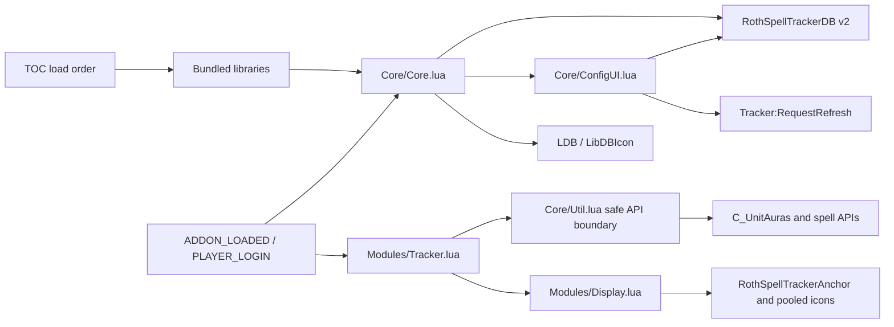

# Code graph

```mermaid
flowchart LR
  TOC[TOC load order] --> Libs[Bundled libraries]
  Libs --> Core[Core/Core.lua]
  Core --> DB[RothSpellTrackerDB v2]
  Core --> UI[Core/ConfigUI.lua]
  UI --> DB
  UI --> Refresh[Tracker:RequestRefresh]
  Events[ADDON_LOADED / PLAYER_LOGIN] --> Core
  Events --> Tracker[Modules/Tracker.lua]
  Tracker --> Safe[Core/Util.lua safe API boundary]
  Safe --> Aura[C_UnitAuras and spell APIs]
  Tracker --> Display[Modules/Display.lua]
  Display --> Anchor[RothSpellTrackerAnchor and pooled icons]
  Core --> Minimap[LDB / LibDBIcon]
```
