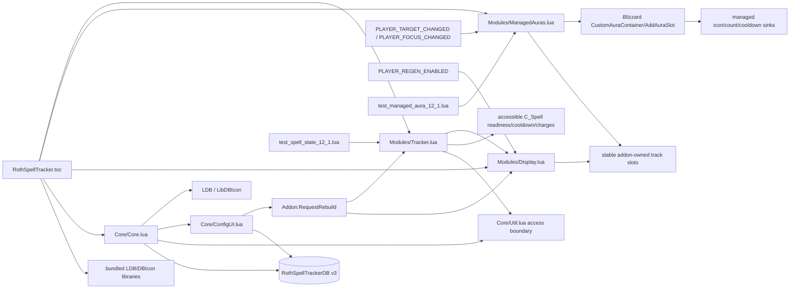

# Roth Spell Tracker code graph

```mermaid
flowchart LR
  T["RothSpellTracker.toc"] --> L["bundled LDB/DBIcon libraries"]
  T --> C["Core/Core.lua"]
  T --> D["Modules/Display.lua"]
  T --> A["Modules/ManagedAuras.lua"]
  T --> S["Modules/Tracker.lua"]
  C --> DB[("RothSpellTrackerDB v3")]
  C --> U["Core/Util.lua access boundary"]
  C --> UI["Core/ConfigUI.lua"]
  UI --> DB
  UI --> R["Addon:RequestRebuild"]
  R --> D
  R --> S
  D --> ST["stable addon-owned track slots"]
  A --> ST
  A --> AC["Blizzard CustomAuraContainer/AddAuraSlot"]
  AC --> AB["managed icon/count/cooldown sinks"]
  S --> U
  S --> SP["accessible C_Spell readiness/cooldown/charges"]
  S --> D
  E["PLAYER_TARGET_CHANGED / PLAYER_FOCUS_CHANGED"] --> A
  G["PLAYER_REGEN_ENABLED"] --> D
  C --> M["LDB / LibDBIcon"]
  X1["test_managed_aura_12_1.lua"] --> A
  X2["test_spell_state_12_1.lua"] --> S
```

There is no addon `UNIT_AURA`, raw AuraData cache, aura frame-tree scan, or state-driven layout compaction.
