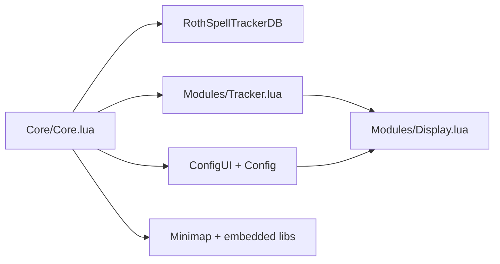

# Code graph

```mermaid
flowchart LR
  Core[Core/Core.lua] --> DB[RothSpellTrackerDB]
  Core --> Config[ConfigUI + Config]
  Core --> Tracker[Modules/Tracker.lua]
  Tracker --> Display[Modules/Display.lua]
  Config --> Display
  Core --> Minimap[Minimap + embedded libs]
```
